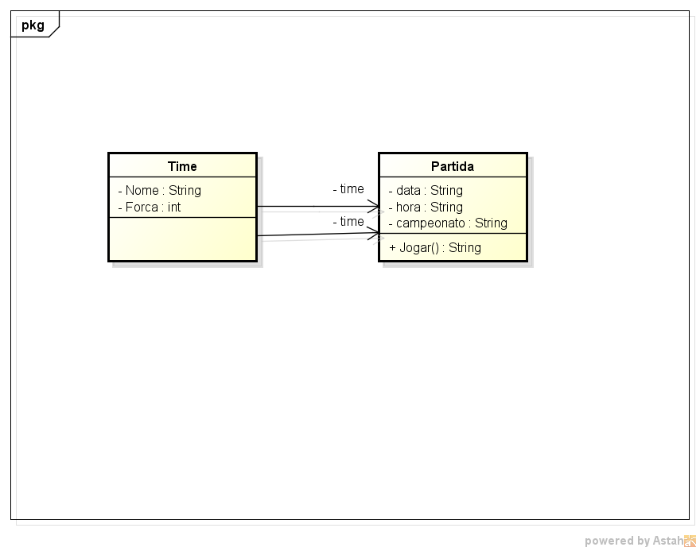

# Sistema de Partida
 Trabalho de POO

## Funcionamento
O trabalho consiste em adicionar uma partida entre dois times e dizer se há um vencedor baseado na probabilidade, de acordo com força de cada time informado pelo usuário. Gera-se um numero aleatório de 1 a 100 que é comparado com a força do time 1, é feito uma regra de 3 pra calcular a probabilidade do time 1 vencer ou perder. Se a diferença entre o número random gerado e a probabilidade do time 1 vencer for <= 10 é considerado empate, se o numero random for < que a probabilidade do time 1 vencer, o time 1 vence, caso contrário, o time 2 vence.

## Diagrama de Clasee

 
